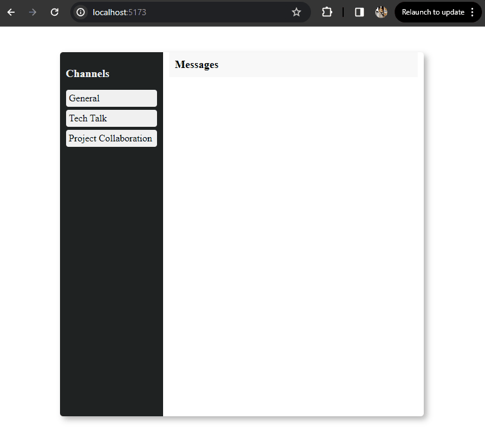

# Message Board Prototype

### Description

This is a prototype message board application for in-house use. The application is built with React for the frontend and NodeJS for the backend. It allows users to select channels, view messages, and submit new messages.

### Project preview

Explore a sneak peek of this project with this animated GIF showcasing key features and the user interface.

### Installation

##### Frontend

1. Navigate to the `client` directory.
2. Run `npm install` to install dependencies.
3. Run `npm run dev` to start the React development server.

##### Backend

1. Navigate to the `server` directory.
2. Run `npm install` to install dependencies.
3. Run `npm run dev` to start the NodeJS server.

### Features

##### Client visual

- [x] Render a full-page application with three panels: Navigation, Message List, and Editor.
- [x] Navigation panel shows a list of channels.
- [x] Message list panel shows a list of message bodies for the selected channel.
- [x] Editor panel shows a text area input.
  - [x] Editor panel is hidden if there is no channel selected.
  - [x] Editor has a submit button.
  - [x] Submit button is disabled if there is no text in the message body.

##### Interactions

- [x] Channel in navigation panel selects that channel
- [x] Entering text in the editor and clicking submit adds a message to the currently selected channel.
- [x] Submitting the editor clears the input.
- [x] Switching channels clears the input.

##### State Management

- [x] Channel list is loaded once on application load.
- [x] Initially, no channel is selected.
- [x] Selected channel and messages:
  - [x] There is no upfront loading of messages
  - [x] Messages already in local state are shown immediately.
  - [x] Messages are loaded from the remote server on channel selection and updated to the screen.
  - [x] Messages are also stored in local state after loading from the remote server.

##### Messages

- [x] Editing messages is not required, only creation.
- [x] Upon submitting a message to a channel, that message is available for other users.
- [x] The submitting user sees the message in the message list immediately before refreshing from the backend.
- [x] No error handling is required.

##### Backend

- [x] Channel and message storage is an in-memory database.
- [-] On server start, storage is populated with a fixed set of empty channels.
      (It was decided to populate channels with some messages for the sake of demonstration purposes.)

##### API Endpoints

- [x] Channel and message storage can be an in-memory database (global variable etc).
- [x] GET endpoint for querying channels: `GET http://<backend>/channels`
- [x] GET endpoint for querying a channel's messages: `GET http://<backend>/messages/<channel>`
- [x] POST endpoint for submitting new messages to a channel: `POST http://<backend>/<channel>`
  - [x] Body: `text` - Message text

### Technologies Used

- React
- NodeJS
- Axios (for HTTP requests)
- Express (web application framework for Node.js)

### Author

Elena Golovanova
- [GitHub](https://github.com/ElenaCoder/)
- [LinkedIn](https://www.linkedin.com/in/elena-golovanova/)
